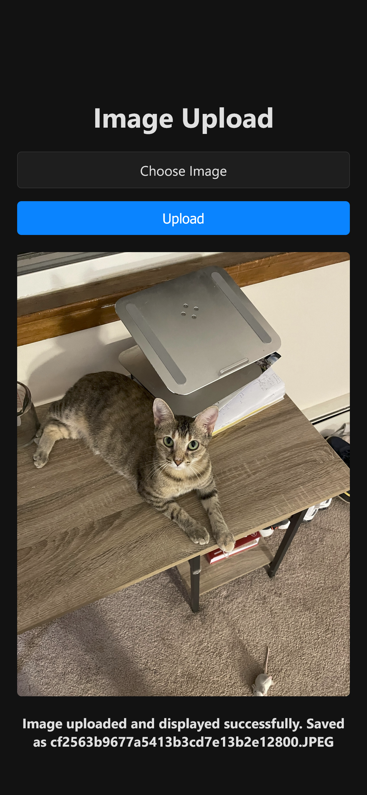

# PaperPi

Display images on an 7-color E-Paper screen using a Raspberry Pi, without the need for continuous power. Perfect for low-power, long-lasting image displays.

E-paper device and docs: https://www.waveshare.com/wiki/7.5inch_e-Paper_HAT_Manual




## Installation

Enable SPI through raspi-config

Python packages

```bash
$ sudo apt-get update
$ sudo apt-get install python3-pip
$ sudo apt-get install python3-pil
$ sudo apt-get install python3-numpy
$ sudo pip3 install spidev
```

Web server (optional)

```bash
$ sudo apt-get install nodejs npm
$ cd web
$ npm i
```

## Usage

Single image display:

```bash
$ python display/display.py images/your_image.jpg
```

Cycle through images

```bash
$ python display/cycle_images.py
```

Start Web server and open http://localhost:3000/

```bash
$ cd web
$ node app.js
```
